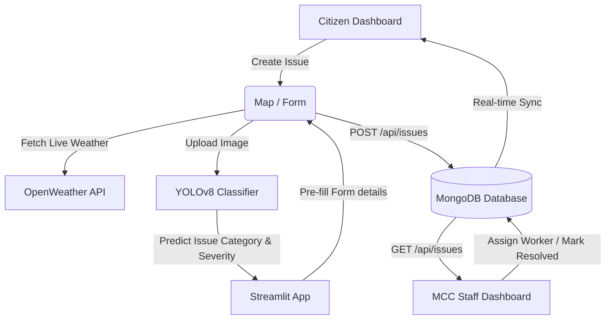

# 🏙 CityScope: Smart City Initiative Project Report

An AI-Powered Civic Issue Tracking & Predictive Maintenance Platform.

---

## 1. Executive Summary
**CityScope** is a modern, real-time web platform designed to streamline communication between citizens and the Mangalore City Corporation (MCC). By combining interactive geospatial mapping, real-time database syncing, and a machine learning (YOLOv8) image classification pipeline, CityScope empowers citizens to report civic grievances (potholes, garbage dumping, broken streetlights) and enables municipal authorities to manage and prioritize resolutions efficiently.

---

## 2. Problem Statement
Traditional municipal complaint tracking systems suffer from several key inefficiencies:
1. **Communication Gap**: Citizens report issues via phone calls or physical visits, leading to untracked reports and lack of status updates.
2. **Lack of Location Accuracy**: Report locations are often descriptive rather than exact, making it difficult for field workers to locate issues.
3. **Manual Routing Inefficiencies**: City staff must manually review complaints to classify the issue and assign it to the correct department (e.g., Waste Management vs. Electricity Board), causing severe delays.
4. **Reactive Maintenance**: Municipalities only address issues *after* they happen, leading to high repair costs and increased safety hazards.

---

## 3. Solution Overview
CityScope solves these challenges by automating and digitizing the entire workflow:
1. **Citizen Portal**: Citizens can report complaints using GPS coordinates, take/upload photos of issues, and write descriptions.
2. **Editable Geospatial Mapping**: Incorporates an interactive map of Mangalore. Citizens can drag, adjust, or manually correct location addresses.
3. **Automated AI Routing**: Built-in YOLOv8 image classifier automatically identifies the type of issue from uploaded photos and routes it to the corresponding department with severity scores.
4. **Real-time Synchronization**: Powered by MongoDB, ensuring updates (assignments, status changes to "In Progress" or "Resolved") propagate instantly to both citizens and MCC staff.
5. **Proactive Analytics**: High-risk hotspots (predicted garbage accumulations and pothole formations) are displayed on a predictive maintenance queue to schedule proactive repairs.

---

## 4. Technology Stack & Rationale

| Technology | Role | Rationale |
| :--- | :--- | :--- |
| **Next.js 15 (React 18)** | Frontend & Backend API | Supports serverless API routing (App Router) and offers Fast Refresh, optimizing development and performance. |
| **TailwindCSS** | User Interface Styling | Enables premium styling, responsive grids, and clean layout patterns with minimal bundle size. |
| **MongoDB** | Database | A document-oriented NoSQL database that fits JSON issue payloads perfectly, facilitating rapid prototyping and schema flexibility. |
| **YOLOv8 (Ultralytics)** | Computer Vision Classifier | State-of-the-art object detection and image classification model trained to classify civic issues with high speed and confidence. |
| **Streamlit** | ML Application Server | An easy-to-use Python web framework to serve the machine learning pipeline on a separate port (`8501`) for image classification. |
| **OpenWeather API** | Live Weather Fetching | Provides real-time Mangalore weather stats to record ambient humidity/temperature metadata at the time of reporting. |

---

## 5. Functional Modules In-Depth

### 5.1 Citizen Portal & Dashboard
The Citizen Dashboard serves as the primary touchpoint for residents of Mangalore to interact with city services.
* **OTP-Based Access**: Citizens log in using a 10-digit mobile number with quick OTP verification (simulated with a responsive 200ms loading latency), bypassing complex password storage.
* **Complaint Registration Form**:
  - **Quick Categories**: Dedicated cards for Potholes, Garbage, and Streetlights redirect citizens to tailored input forms.
  - **Editable Geolocation**: Uses GPS to fetch street addresses automatically via OpenStreetMap API. Citizens can manually edit or correct the street address directly in the input box before submitting.
  - **Real-Time Weather Integration**: Fetches real-time Temperature, Condition, Humidity, and Wind Speed in Mangalore at the moment of reporting and binds this metadata to the ticket.
* **My Reported Issues Tracker**: A dynamic listing showing ticket numbers, complaint titles, submission dates, and real-time status badges (`Pending` in yellow, `In Progress` in blue, `Resolved` in green).
* **Mangalore Widgets**: The right-hand sidebar features a live weather widget and local municipal news updates (e.g., MG Road repairs or water notice announcements).

### 5.2 MCC Staff Portal & Dashboard
The MCC Staff Dashboard provides municipal officials with the tools needed to manage city grievances and schedule repairs.
* **Staff Login**: Secure credentials-based authentication for authorized city officers.
* **Statistical Metrics Overview**: Counter cards showing totals for Total Issues, Pending, In Progress, and Resolved complaints, plus department-wise distribution charts.
* **Issue Management Grid**:
  - **Assignment Panel**: Officers can assign individual issues to field crews (e.g. Worker Team A) and transition status states.
  - **Resolution Verification**: When work is completed, staff upload verification photos and input closing notes, notifying the citizen.
* **Predictive Maintenance Dashboard**:
  - **Accumulation & Pothole Forecasts**: Integrates predictive SVG risk charts (scores 0-10) for garbage hotspots in zones like Kadri or Bunder, and road segment pothole formations on high-traffic roads like Pumpwell and Padil.
  - **Priority Maintenance Queue**: Automatically filters and highlights areas with high risk scores (> 8) in a centralized queue table for proactive repair scheduling.
  - **ML Web App Launcher**: Features a launchpad card linking directly to the YOLOv8 image classifier web application.
* **Construction Companies Registry**: Tracks registered municipal road developers. Allows staff to automatically generate and download official PDF/CSV Complaint Notices for poorly constructed roads that develop potholes.

---

## 6. Machine Learning YOLOv8 Classifier
The core AI intelligence of CityScope is powered by a YOLOv8 (You Only Look Once) classification model.
* **Model Training & Weights**: The model uses a fine-tuned `best.pt` file trained on civic issue datasets, providing fast classification inference times.
* **Supported Categories & Department Routing**:
  1. `Flood` & `Water Logging` → Automatically assigned to **Municipal Water Management**
  2. `Garbage` → Automatically assigned to **Ministry of Housing and Urban Affairs**
  3. `Pothole Issues` → Automatically assigned to **Public Works Department (PWD)**
  4. `signal Broken` → Automatically assigned to **Traffic Management Department**
  5. `street light Pole` → Automatically assigned to **Electricity Board**
* **Workflow Integration**: When an image is uploaded in the Streamlit Classifier (`ml/App.py`), the model outputs category probabilities (e.g. `Pothole Issues: 100%`). The system maps the category to the correct department and assigns a severity rating (`Low` if conf < 40%, `Medium` if < 70%, `High` if >= 70%).

---

## 7. System Architecture & Working Flow



### 7.1 Real-Time Synchronization
* **Database Connection Check**: The `/api/health` endpoint pings the local MongoDB database. The frontend displays **🟢 DB Connected** dynamically.
* **GET `/api/issues`**: Retrieves all records from the database sorted in descending order of ID. If the database is empty, it automatically seeds it with initial default issues.
* **POST `/api/issues`**: Inserts a new report (including GPS, editable location, photos, weather metadata, and timestamp) directly into the MongoDB collection.

---

## 8. How to Run the Project

### 6.1 Prerequisites
* Install **Node.js** (v18 or higher)
* Install **Python** (v3.8 or higher)
* Install **MongoDB Community Server** and ensure it is running locally on port `27017`

### 6.2 Set Up & Run the Web Server (Next.js)
1. Open a terminal in the root directory:
   ```bash
   cd c:\Users\RAKSHA\Downloads\CityScope
   ```
2. Install dependencies:
   ```bash
   npm install
   ```
3. Start the Next.js development server:
   ```bash
   npm run dev
   ```
4. Open **[http://localhost:3000](http://localhost:3000)** in your browser.

### 6.3 Set Up & Run the Machine Learning Server (Streamlit)
1. Open a separate terminal window and navigate to the `ml` directory:
   ```bash
   cd c:\Users\RAKSHA\Downloads\CityScope\ml
   ```
2. Install python dependencies:
   ```bash
   pip install -r requirements.txt
   ```
3. Start the Streamlit server:
   ```bash
   python -m streamlit run App.py --server.port 8501 --server.address 127.0.0.1
   ```
4. The ML application will open at **[http://localhost:8501](http://localhost:8501)**. You can upload images of civic issues here to test YOLOv8 classifications.
